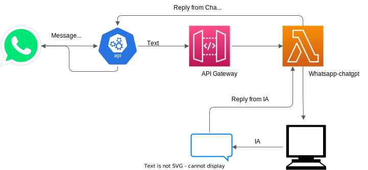

# Integration ChatGPT and WhatsApp

This integration connect the IA ChatGPT on a Profile from WhatsApp using Twilio

### API Structure

| HTTP METHOD  | POST     |
| ------------ | -------- |
| Send Message | Send     |
| /            | Ok (200) |

## Infrastructure Architeture



#

## Prerequisites

You will need a Twilio account, can be a free tier, and a AWS Account already connected to serverless framework.

You need a ChatGPT key to.

If have any doubt can look on the following links:

- [Twilio](https://www.twilio.com/docs/whatsapp/sandbox)
- [Serverless](https://www.serverless.com/framework/docs/providers/aws/cli-reference/config-credentials)
- [ChatGPT](https://platform.openai.com/account/api-keys)

#

## Installation

Clone this repository to your local machine.

```bash
$ git clone https://github.com/gabrielmatuk/chatgpt-whatsapp-sync.git
```

Then, you will run the following command.

```bash
$ make build
```

## Usage

You will run:

```bash
$ serverless deploy
```

After that, get the URL from your lambda server and configure that on your WhatsApp Sandbox.

When you send a message to Sandbox number the ChatGPT you will reply you.

Enjoy!
